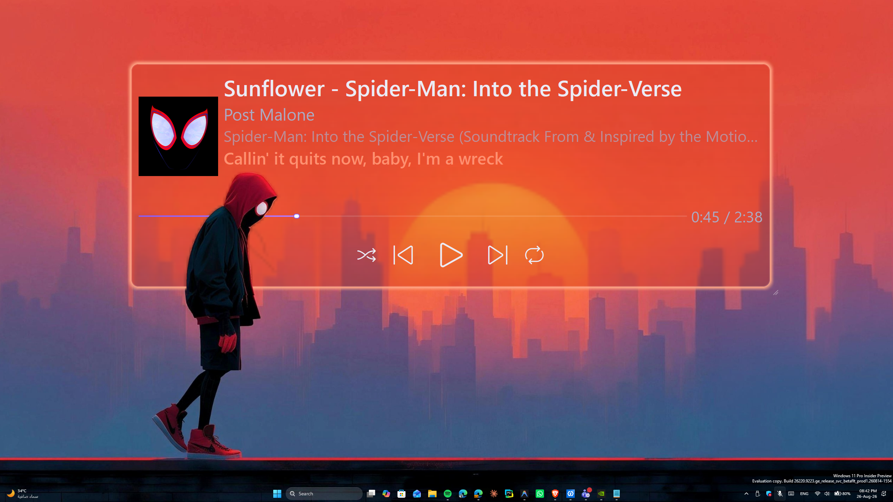

<p align="center">
  
</p>

<h1 align="center">🎵 GMP — Glass Media Player</h1>

<p align="center">
  <b>A depth-layered desktop music overlay for Windows 11</b><br>
  <sub>Glassmorphic player that embeds behind your wallpaper's foreground with AI depth, synced lyrics & auto-theming</sub>
</p>

<p align="center">
  
  
  
  
  
</p>

---

## ✨ Features

| Feature | Description |
|---------|-------------|
| 🪟 **Desktop Integration** | Embeds directly into the Windows desktop layer — sits between your wallpaper and desktop icons |
| 🌊 **AI Depth Effect** | Uses U²-Net AI to extract wallpaper foreground, creating a parallax illusion where the player sits *behind* objects |
| 🎤 **Synced Lyrics** | Real-time synchronized lyrics from LrcLib — line-by-line as the song plays |
| 🎨 **Auto-Theming** | Automatically extracts dominant colors from your wallpaper and applies them to the player |
| 💎 **Glassmorphism** | Frosted glass card with blur background, configurable glow, and gradient effects |
| 🎛️ **Full Controls** | Play/pause, next, previous, shuffle, repeat, and seek — all through the desktop widget |
| ⚙️ **Customizable** | Every visual setting is adjustable: opacity, glow, colors, size, position, and more |
| 🔄 **Universal Media** | Works with **any** media source — Spotify, YouTube, VLC, Apple Music, browser players |
| 📌 **Persistent Layout** | Remembers your position, size, colors, and all settings between sessions |
| 🚀 **Startup Mode** | Optional auto-launch at Windows login with silent tray mode |

---

## 🖼️ How It Works

```
                      ┌─────────────────────────┐
Desktop Icons         │  Foreground Mask (AI)    │  ← Click-through
                      ├─────────────────────────┤
GMP Player Card       │  Glassmorphic Widget     │  ← Interactive
                      ├─────────────────────────┤
Wallpaper             │  Windows Desktop         │  ← System layer
                      └─────────────────────────┘
```

The player embeds into the Windows **WorkerW** desktop layer using the Progman `0x052C` trick. An AI-generated foreground mask is composited on top, creating the illusion that the player sits *behind* real-world objects in your wallpaper.

---

## 🚀 Quick Start

### Prerequisites

- **Windows 11** (Windows 10 may work with limited features)
- **Python 3.11+** → [Download](https://www.python.org/downloads/)
- **Git** → [Download](https://git-scm.com/downloads)
- A media player running (Spotify, YouTube, VLC, etc.)

### Installation

```bash
# 1. Clone the repository
git clone https://github.com/george-g-girgis/GMP.git
cd GMP

# 2. Create virtual environment
python -m venv .venv

# 3. Activate it
.venv\Scripts\activate

# 4. Install dependencies
pip install -r requirements.txt

# 5. Launch GMP
python main.py
```

### First Launch

On first run, a **Setup Wizard** will guide you through initial configuration:

1. **Welcome** — Overview of GMP
2. **Customize** — Set card opacity, glow intensity, depth effect, and AI model
3. **Startup** — Choose whether to auto-start with Windows

After setup, GMP runs silently from the **system tray** ♫.

---

## 🎮 Usage

### System Tray

Right-click the purple ♫ tray icon for:
- ⚙️ **Settings** — Open the full settings dialog
- 🔄 **Re-segment Wallpaper** — Force a new depth mask
- 🌊 **Toggle Depth Effect** — Enable/disable the AI depth layer
- ✖ **Quit** — Exit GMP

Double-click the tray icon to open Settings.

### Player Widget

- **Drag** the card anywhere on your desktop
- **Resize** using the grip handle in the bottom-right corner
- **Right-click** the player card to open Settings
- **Lock layout** in Settings to prevent accidental moves

### Keyboard-Free Controls

All playback controls are on the widget: ◁ ▷ ▷▷ ⟲ 🔀 — or use your keyboard media keys as usual.

---

## ⚙️ Settings

Access settings via **right-click on the player** or the **system tray menu**.

| Tab | Options |
|-----|---------|
| **Appearance** | Card opacity, glow intensity, lock layout, player size |
| **Colors** | Lyrics color, background color, glow color, auto-theme toggle |
| **Depth Effect** | Enable/disable, AI model selection (u2net, u2netp, isnet), re-segment, clear cache |
| **Playback** | Poll rate (smoothness vs CPU), synced lyrics toggle |
| **Startup** | Auto-launch at login, wallpaper check interval |
| **About** | Version info, reset all settings |

---

## 🏗️ Architecture

```
GMP/
├── main.py              # Entry point & App controller
├── core/
│   ├── config.py        # Centralized settings (JSON, signals)
│   ├── media.py         # WinRT GSMTC media bridge (async)
│   ├── lyrics.py        # LrcLib synced lyrics fetcher
│   ├── segmenter.py     # AI foreground extraction (rembg/U²-Net)
│   ├── wallpaper.py     # Desktop wallpaper change listener
│   └── autostart.py     # Windows registry autostart
├── ui/
│   ├── overlay.py       # Desktop-embedded composite window
│   ├── widget.py        # Glassmorphic player card
│   ├── settings.py      # Tabbed settings dialog
│   └── setup.py         # First-run wizard
├── requirements.txt
├── Launch GMP.vbs       # Silent launcher (no console)
└── .gitignore
```

### Key Design Decisions

- **WinRT over Spotipy**: Uses Windows' native Global System Media Transport Controls — works with *any* media source, no API keys needed
- **Debounced Config**: All settings changes coalesce into a single disk write every 500ms
- **Thread Safety**: Media polling, lyrics fetching, and AI segmentation each run in dedicated `QThread`s — zero UI blocking
- **Signal-Driven**: All modules communicate via `pyqtSignal` — no polling, no tight coupling
- **Smart Caching**: Segmentation results are cached by wallpaper hash — instant load on repeat wallpapers

---

## 🛠️ Tech Stack

| Component | Technology |
|-----------|-----------|
| **UI Framework** | PyQt6 |
| **Media Detection** | WinRT (winrt-Windows.Media.Control) |
| **Lyrics** | LrcLib API (free, no auth) |
| **AI Segmentation** | rembg + ONNX Runtime (U²-Net) |
| **Image Processing** | Pillow |
| **Desktop Integration** | Win32 API (ctypes) |
| **Config Storage** | JSON (`%APPDATA%/GMP/config.json`) |

---

## 🐛 Troubleshooting

| Issue | Solution |
|-------|----------|
| **Player not visible** | Check system tray for the ♫ icon. Try double-clicking it. |
| **No media detected** | Make sure a media player is running (Spotify, YouTube, etc.) |
| **Depth effect not working** | Ensure `rembg` is installed. Check tray for progress messages. |
| **WorkerW fallback warning** | Normal on some configurations — the player still works, just uses Z-order layering instead. |
| **Lyrics not showing** | Not all songs have synced lyrics on LrcLib. The player will show "No synced lyrics found." |
| **High CPU usage** | Increase the poll rate in Settings → Playback (higher ms = less CPU). |

---

## 📄 License

This project is licensed under the **MIT License** — see the [LICENSE](LICENSE) file for details.

---

## 🤝 Contributing

Contributions are welcome! Feel free to:
1. Fork the repo
2. Create a feature branch (`git checkout -b feature/my-feature`)
3. Commit your changes
4. Push and open a Pull Request

---

<p align="center">
  Built with 💜 by <a href="https://github.com/george-g-girgis">GGG</a>
</p>
